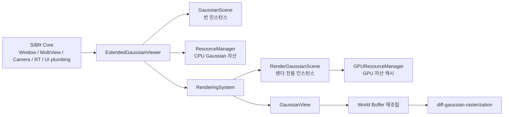

# Extended Gaussian와 SIBR Viewer의 차이 정리

## 한 줄 결론

이 프로젝트는 **SIBR viewer를 버리고 새로 만든 뷰어**가 아니라, **SIBR의 윈도우/멀티뷰/카메라/렌더 타깃 프레임워크를 그대로 활용하면서 Gaussian 전용 자산 관리와 CUDA 렌더링 계층을 크게 덧붙인 프로젝트**다.

즉:

- 바깥 껍데기와 앱 프레임은 SIBR와 많이 같다.
- 안쪽 자산 모델과 렌더러는 SIBR 기본 viewer와 꽤 다르다.

## 빠른 판단

실무적으로 보면 이 프로젝트는 아래처럼 이해하는 것이 가장 정확하다.

| 항목 | 판단 |
| --- | --- |
| 앱 프레임워크 | SIBR 재사용 비중이 큼 |
| 윈도우/입력/카메라/멀티뷰 | 거의 SIBR 스타일 그대로 |
| Gaussian 자산 로딩 | 이 프로젝트 전용 |
| GPU 자원 관리 | 이 프로젝트 전용 |
| 실시간 렌더링 핵심 | SIBR 기본 viewer와 다름 |
| CUDA rasterizer | 외부 `diff-gaussian-rasterization` 사용 |

짧게 말하면:

- **프레임워크 관점**에서는 SIBR 기반이다.
- **렌더링 파이프라인 관점**에서는 커스텀 Gaussian viewer에 가깝다.

## 코드 기준으로 보면 왜 그렇게 말할 수 있나

### 1. SIBR 쪽을 그대로 쓰는 부분

이 프로젝트는 다음 축을 직접 다시 만들지 않았다.

- OS 윈도우 생성
- 메인 루프 구조
- 입력 폴링
- 멀티뷰 관리자
- IBR subview 렌더 orchestration
- 카메라 핸들러
- 오프스크린 렌더 타깃과 최종 표시
- 캡처/비디오 export 같은 공용 기능

핵심 근거:

- `src/projects/M_GStream/apps/M_GStreamViewer/main.cpp`
  - `sibr::Window` 생성
  - `viewer.onUpdate()`, `viewer.onRender()`, `viewer.onSwapBuffer()` 호출
- `src/projects/M_GStream/renderer/ExtendedGaussianViewer.hpp`
  - `ExtendedGaussianViewer`가 `sibr::MultiViewBase`를 상속
- `src/projects/M_GStream/renderer/CMakeLists.txt`
  - `sibr_system`, `sibr_view`, `sibr_assets`, `sibr_renderer` 링크

즉 이 프로젝트는 애플리케이션 뼈대를 SIBR에서 가져오고 그 위에 프로젝트 전용 코드를 얹는다.

### 2. 이 프로젝트가 새로 만든 부분

SIBR 기본 viewer와 실질적으로 달라지는 지점은 아래다.

- Gaussian 학습 결과 디렉터리 해석
- `cfg_args`와 `iteration_*` 기반 최신 모델 선택
- Gaussian field를 CPU 자산으로 보관하는 구조
- scene instance와 render instance 분리
- GPU 캐시 매니저
- 매 프레임 world Gaussian buffer 재조립
- CUDA kernel을 통한 transform 적용
- `diff-gaussian-rasterization` 호출
- ImGui 기반 asset browser / scene outliner

이 부분은 거의 전부 `src/projects/M_GStream/*` 안에 있다.

## 구조를 그림으로 보면

이 그림이 말하는 핵심은 단순하다.

- 왼쪽 절반은 SIBR 프레임워크다.
- 오른쪽 절반은 Extended Gaussian 전용 로직이다.

## 어느 정도나 다른가

정성적으로는 아래처럼 볼 수 있다.

### SIBR와 비슷한 층

- 프로그램 시작 방식
- 윈도우 생성
- 입력 처리
- 렌더 루프
- 뷰 배치
- 카메라 조작
- offscreen render target 후 ImGui 표시

이 층은 사실상 SIBR 생태계의 표준 패턴을 그대로 따른다.

### SIBR와 많이 다른 층

- 데이터 단위가 dataset/image/camera 중심이 아니라 Gaussian asset 중심
- 자산과 씬 인스턴스를 분리해 여러 번 배치 가능
- CPU 자산과 GPU 자산을 별도로 캐시
- 매 프레임 인스턴스를 world buffer에 다시 합성
- CUDA 기반 splatting 렌더러 호출

즉 이 프로젝트는 **"SIBR generic viewer"라기보다 "SIBR 위에서 동작하는 Gaussian editor/viewer"**다.

## 항목별 비교표

| 구분 | SIBR 기본 viewer 느낌 | Extended Gaussian |
| --- | --- | --- |
| 실행 프레임 | 공용 SIBR app 패턴 | 동일 패턴 사용 |
| 뷰 구성 | MultiViewBase 기반 | 그대로 사용 |
| 카메라 | SIBR camera handler | 그대로 사용 |
| 자산 입력 | 일반 scene/dataset 계열 | Gaussian 학습 결과 디렉터리 |
| 렌더링 데이터 | 전통적인 scene/mesh/image 기반 | GaussianField / GaussianInstance 기반 |
| GPU 자원 관리 | 공용 프레임워크 성격 | `GPUResourceManager`로 전용 관리 |
| 프레임 렌더링 | 각 viewer 구현에 따라 다름 | GPU field가 있는 인스턴스를 world buffer로 재조립 |
| 렌더러 백엔드 | 프로젝트별 상이 | CUDA + external rasterizer |
| 편집 기능 | 제한적 또는 프로젝트별 상이 | asset import / instance 생성 / transform 편집 |

## 추천하는 탐색 순서

SIBR와의 차이를 빠르게 파악하려면 아래 순서가 좋다.

1. `src/projects/M_GStream/apps/M_GStreamViewer/main.cpp`
2. `src/projects/M_GStream/renderer/ExtendedGaussianViewer.*`
3. `src/projects/M_GStream/renderer/resource/*`
4. `src/projects/M_GStream/renderer/scene/*`
5. `src/projects/M_GStream/renderer/subsystem/rendering_system/*`
6. 그 다음 필요할 때만 `src/core/view/*`와 `src/core/graphics/*`

이 순서로 보면:

- 어디까지가 SIBR 공용인지
- 어디부터가 Gaussian 전용인지

경계가 명확해진다.
