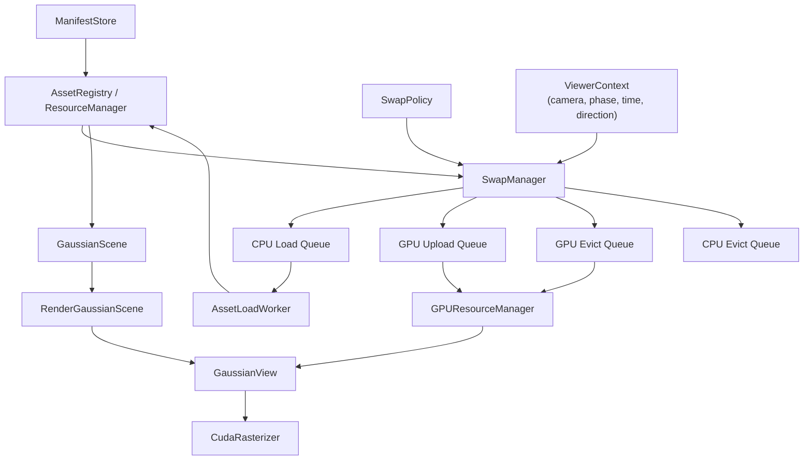
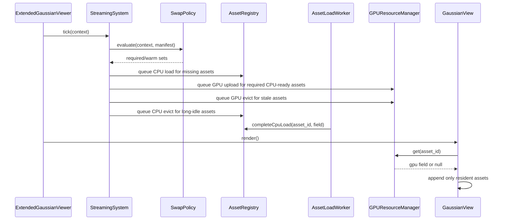

# SIBR 기반 Gaussian Viewer 동적 스왑 설계안

## 1. 문서 개요

본 문서는 **완성된 Gaussian 자산(`.ply` / `model_dir`)을 특정 프로세스와 현재 시점에 따라 자동으로 load / unload / swap 하면서 실시간 렌더링하는 viewer**를 구현하기 위한 상세 설계안이다.

설계의 기본 전제는 다음과 같다.

- **SIBR core 전체를 확장 대상으로 삼지 않는다.**
- `src/projects/M_GStream/*` 계층을 중심으로 기능을 추가한다.
- 초기 목표는 **viewer 기능**이며, 편집기 전체를 완성하는 것이 아니다.
- 구현은 **GPU-only swap**을 먼저 완성한 뒤, 이후 **CPU unload**, 마지막으로 필요 시 **chunk 단위 streaming**으로 확장한다.

현재 코드베이스는 SIBR의 윈도우, 멀티뷰, 카메라, 렌더 타깃 프레임워크를 재사용하고, `M_GStream` 프로젝트 계층에서 Gaussian 자산 로딩, 씬 인스턴스, GPU 자원 관리, world buffer 재조립, CUDA rasterizer 호출을 담당하고 있다. 따라서 본 설계는 **SIBR 전체 개조가 아니라 M_GStream 계층에 streaming / residency 기능을 삽입하는 방향**을 전제로 한다.

---

## 2. 문제 정의

현재 목표는 다음과 같다.

1. 여러 개의 완성된 Gaussian 자산을 외부 메타파일로 관리한다.
2. 현재 상태(카메라, 시간, phase, 외부 프로세스 상태)에 따라 필요한 자산만 자동으로 올린다.
3. 필요 없어진 자산은 GPU 또는 CPU 메모리에서 안전하게 내린다.
4. viewer는 가능한 한 끊김 없이 결과를 사용자에게 보여준다.

현재 코드 구조는 자동 스왑의 출발점으로는 좋지만, 그대로는 안전하지 않다. 특히 다음 문제가 핵심이다.

- `GaussianInstance`가 `const GaussianField*` raw pointer를 들고 있어 CPU unload 시 dangling pointer 위험이 있다.
- `GPUResourceManager`가 CPU pointer를 key로 사용하고 있어 CPU asset을 내렸다 다시 올릴 경우 logical identity와 cache identity가 분리된다.
- `RenderGaussianInstance`가 GPU field를 강하게 소유하는 구조라면 GPU unload가 불가능해진다.
- `GaussianLoader`는 단일 `.ply`보다 `model_dir / cfg_args / point_cloud/iteration_xxxx/point_cloud.ply` 구조를 전제로 하므로, manifest도 이 구조를 반영해야 한다.

따라서 자동 스왑을 구현하기 전에 **자산 identity, ownership, residency state를 먼저 재정의**해야 한다.

---

## 3. 설계 목표

### 3.1 핵심 목표

- 외부 manifest 기반 Gaussian 자산 등록
- phase / camera / distance 기반 desired asset set 계산
- GPU residency 자동 관리
- 이후 CPU residency 자동 관리 확장
- SIBR core 수정 최소화
- 기존 `GaussianView` 렌더 경로 최대한 재사용
- 프레임 드롭과 pop-in 최소화

### 3.2 비목표

- SIBR 전체 기능 재구성
- Gaussian training pipeline 변경
- 초기에 chunk 단위 부분 스트리밍까지 한 번에 구현
- 초기에 완전 일반화된 rule engine 구현

### 3.3 설계 원칙

1. **identity는 pointer가 아니라 `asset_id`로 관리한다.**
2. **ownership은 중앙 매니저가 가진다.**
3. **instance는 logical reference만 가진다.**
4. **GPU unload와 CPU unload를 분리한다.**
5. **디스크 I/O는 background thread, GPU upload는 render thread에서 처리한다.**
6. **초기 MVP는 rule 기반 + hysteresis 기반으로 단순하게 만든다.**

---

## 4. 현재 코드 구조 요약

현재 구조는 다음 네 층으로 분리되어 있다.

1. **CPU asset**
   - `GaussianField`
   - `ResourceManager`

2. **CPU scene placement**
   - `GaussianInstance`
   - `GaussianScene`

3. **GPU asset cache**
   - `GPUGaussianField`
   - `GPUResourceManager`
   - `RenderGaussianInstance`
   - `RenderGaussianScene`

4. **frame-local world buffer**
   - `GaussianView`
   - 매 프레임 현재 인스턴스를 world buffer로 재조립
   - 이후 `diff-gaussian-rasterization` 호출

이 계층 분리는 유지하는 것이 맞다. 자동 스왑은 이 구조를 뒤엎기보다, **asset registry / residency manager / swap manager / background loader**를 추가해 각 층의 연결 규칙만 바꾸는 것이 바람직하다.

---

## 5. 제안 아키텍처

## 5.1 상위 구조



### 5.2 계층별 역할

- **ManifestStore**
  - 외부 JSON manifest 파싱
  - asset metadata, bounds, tags, phase rules 저장

- **AssetRegistry**
  - `asset_id` 기준 logical asset 등록
  - CPU residency state 관리
  - CPU `GaussianField` 소유

- **GPUResourceManager**
  - `asset_id` 기준 GPU resource cache 관리
  - GPU residency state 관리
  - sole strong ownership 유지

- **SwapPolicy**
  - 현재 상태를 입력받아 `required / warm / evictable` asset set 계산

- **SwapManager**
  - 정책 결과와 현재 residency를 비교
  - load / upload / unload / eviction 스케줄링
  - budget, hysteresis, pin, priority 적용

- **AssetLoadWorker**
  - background thread에서 디스크 I/O 처리
  - 로딩 완료 시 CPU residency 갱신

- **GaussianView**
  - 현재 GPU resident 자산만 world buffer에 append
  - 없는 자산은 skip
  - 결과적으로 “지금 메모리에 있는 것만 렌더”

---

## 6. 핵심 데이터 모델

## 6.1 식별자

```cpp
using AssetId = std::string;
using GroupId = std::string;
using PhaseId = std::string;
```

모든 logical Gaussian asset은 `asset_id`로 식별한다.  
이 값은 CPU pointer, GPU pointer, instance pointer와 무관한 **영속 식별자**다.

---

## 6.2 AssetDescriptor

```cpp
struct AssetDescriptor {
    AssetId id;
    std::filesystem::path model_dir;
    std::vector<std::string> tags;

    glm::vec3 bounds_min;
    glm::vec3 bounds_max;

    size_t estimated_cpu_bytes = 0;
    size_t estimated_gpu_bytes = 0;

    int priority = 0;
    bool pin_cpu = false;
    bool pin_gpu = false;

    float prefetch_distance = 0.0f;
    float unload_hysteresis_sec = 1.0f;
};
```

### 설명

- `model_dir`
  - 현재 로더 구조와 맞춘다.
  - 단일 `ply_path` 대신 학습 결과 디렉터리를 직접 가리킨다.

- `bounds_min`, `bounds_max`
  - camera bounds / distance policy 계산에 사용한다.

- `priority`
  - VRAM 부족 시 eviction 순서 결정에 사용한다.

- `pin_cpu`, `pin_gpu`
  - 절대 unload되면 안 되는 자산 표시

---

## 6.3 ResidencyState

```cpp
enum class ResidencyState {
    Registered,      // manifest에만 존재, 아직 아무것도 없음
    CpuLoading,      // worker thread가 디스크에서 로딩 중
    CpuResident,     // CPU field 준비 완료
    GpuUploading,    // render thread가 GPU 업로드 중
    GpuResident,     // GPU field 준비 완료
    CpuGpuResident,  // CPU/GPU 둘 다 준비 완료
    EvictPending,    // unload 예약됨
    Failed           // 로드 실패
};
```

실제 구현에서는 CPU state와 GPU state를 별도로 나누는 편이 더 명확하다.

```cpp
enum class CpuState { Unloaded, Loading, Resident, Failed };
enum class GpuState { Unloaded, UploadQueued, Resident, EvictQueued, Failed };
```

이 문서에서는 설명 편의를 위해 합쳐서 서술하지만, 실제 코드에서는 **CPU / GPU 상태 분리**를 권장한다.

---

## 6.4 AssetRecord

```cpp
struct AssetRecord {
    AssetDescriptor desc;

    CpuState cpu_state = CpuState::Unloaded;
    GpuState gpu_state = GpuState::Unloaded;

    std::shared_ptr<GaussianField> cpu_field;
    std::shared_ptr<GPUGaussianField> gpu_field;

    uint64_t last_requested_frame = 0;
    uint64_t last_visible_frame = 0;
    double last_state_change_time = 0.0;

    bool desired_gpu = false;
    bool desired_cpu = false;

    bool pinned_cpu = false;
    bool pinned_gpu = false;

    size_t actual_cpu_bytes = 0;
    size_t actual_gpu_bytes = 0;
};
```

### ownership 규칙

- `AssetRegistry`가 `cpu_field`의 강한 소유권을 가진다.
- `GPUResourceManager`가 `gpu_field`의 강한 소유권을 가진다.
- `GaussianInstance`와 `RenderGaussianInstance`는 **pointer를 직접 소유하지 않는다.**
- 필요 시 `asset_id`로 lookup 하거나 `weak_ptr`만 가진다.

---

## 6.5 GaussianInstance 변경안

```cpp
struct GaussianInstance {
    std::string name;
    AssetId asset_id;

    glm::vec3 position;
    glm::vec3 euler_angle;
    glm::vec3 scale;

    bool visible = true;
};
```

### 변경 이유

기존의 `const GaussianField* field`는 자동 unload와 양립하기 어렵다.  
`GaussianInstance`는 **배치 정보만 가지고**, 실제 자산 데이터는 중앙 registry가 관리해야 한다.

---

## 6.6 RenderGaussianInstance 변경안

```cpp
class RenderGaussianInstance {
public:
    explicit RenderGaussianInstance(const GaussianInstance* src);

    const GaussianInstance* source() const { return _src; }
    const AssetId& assetId() const { return _asset_id; }

private:
    const GaussianInstance* _src = nullptr;
    AssetId _asset_id;
};
```

### 중요한 변경점

- `RenderGaussianInstance`는 `shared_ptr<GPUGaussianField>`를 오래 들고 있지 않는다.
- 매 프레임 또는 필요 시 `GPUResourceManager`에서 `asset_id`로 조회한다.
- 즉, **GPUResourceManager가 sole owner**가 되어야 GPU eviction이 가능하다.

---

## 7. Manifest 설계

## 7.1 형식

초기 구현은 **JSON**을 사용한다.

이유:

- 현재 코드베이스가 이미 `picojson` 기반 JSON 파싱 경로를 가지고 있어 통합 비용이 낮다.
- block 연결성, page 구성, rules 배열 같은 중첩 데이터를 직렬화하기 쉽다.
- 외부 툴/파이프라인과 교환하기 쉽고 schema 검증을 붙이기에도 유리하다.

---

## 7.2 예시

```json
{
  "global": {
    "target_vram_mb": 8192,
    "target_ram_mb": 32768,
    "max_upload_mb_per_frame": 256,
    "max_gpu_evictions_per_frame": 2,
    "max_cpu_evictions_per_frame": 1,
    "max_concurrent_disk_loads": 2,
    "default_unload_hysteresis_sec": 1.5
  },
  "assets": {
    "street_a": {
      "model_dir": "D:/gaussians/street_a",
      "tags": ["street", "phase_1"],
      "bounds_min": [-10.0, -5.0, 0.0],
      "bounds_max": [20.0, 12.0, 30.0],
      "priority": 10,
      "prefetch_distance": 15.0
    },
    "street_b": {
      "model_dir": "D:/gaussians/street_b",
      "tags": ["street", "phase_1"],
      "bounds_min": [18.0, -5.0, 0.0],
      "bounds_max": [48.0, 12.0, 30.0],
      "priority": 8,
      "prefetch_distance": 15.0
    },
    "indoor_hall": {
      "model_dir": "D:/gaussians/indoor_hall",
      "tags": ["indoor", "phase_2"],
      "bounds_min": [50.0, -10.0, 0.0],
      "bounds_max": [80.0, 30.0, 25.0],
      "priority": 20,
      "prefetch_distance": 10.0
    }
  },
  "rules": [
    {
      "name": "phase_1_base",
      "type": "phase",
      "phase": "phase_1",
      "required": ["street_a"],
      "warm": ["street_b"]
    },
    {
      "name": "phase_1_camera_region",
      "type": "camera_bounds",
      "phase": "phase_1",
      "region_min": [-5.0, -10.0, -10.0],
      "region_max": [35.0, 20.0, 40.0],
      "required": ["street_a", "street_b"]
    },
    {
      "name": "phase_2_base",
      "type": "phase",
      "phase": "phase_2",
      "required": ["indoor_hall"]
    },
    {
      "name": "distance_prefetch",
      "type": "distance",
      "source": "camera",
      "distance": 20.0,
      "warm_by_tag": ["street"]
    }
  ]
}
```

---

## 7.3 rule semantics

정책 결과는 세 등급으로 나눈다.

- **required**
  - 반드시 GPU resident여야 하는 자산
- **warm**
  - CPU resident를 유지하고, budget이 허용하면 GPU에 미리 올려둘 수 있는 자산
- **evictable**
  - 위 둘에 속하지 않는 자산
  - hysteresis 이후 unload 대상

### 장점

- phase와 spatial policy를 함께 쓰기 쉽다.
- “지금 꼭 보여야 하는 것”과 “곧 필요할 수 있는 것”을 분리할 수 있다.
- 바로 CPU/GPU를 동시에 왔다 갔다 하지 않아도 된다.

---

## 8. 기존 코드 변경 지점

## 8.1 `GaussianLoader`

### 현재 문제

현재 로더는 “아무 `.ply`나 읽는 로더”가 아니라, 아래 구조를 전제로 한다.

```text
<model_dir>/
  cfg_args
  point_cloud/
    iteration_0001/
      point_cloud.ply
    iteration_0002/
      point_cloud.ply
```

### 변경안

상태 메모:

- 아래 인터페이스는 아직 미구현 설계안이다.
- Phase 0에서는 `GaussianLoader::load(const std::string& modelPath)`를 유지했고, `loadFromModelDir` / `loadFromDescriptor`는 아직 도입되지 않았다.

```cpp
class GaussianLoader {
public:
    static std::shared_ptr<GaussianField> loadFromModelDir(
        const std::filesystem::path& model_dir);

    static std::shared_ptr<GaussianField> loadFromDescriptor(
        const AssetDescriptor& desc);
};
```

### 적용 원칙

- manifest에서는 `ply_path`보다 `model_dir`를 기록한다.
- 향후 필요 시 `point_cloud_path + sh_degree` 직접 지정 모드를 추가할 수 있다.
- 초기 구현은 기존 로더 로직을 재사용한다.

---

## 8.2 `ResourceManager` → `AssetRegistry`

현재 `ResourceManager`는 단순한 map + add/get/remove 구조에 가깝다.  
자동 스왑을 위해서는 logical registry + residency manager 역할이 필요하다.

### 권장 인터페이스

```cpp
class AssetRegistry {
public:
    bool registerAsset(const AssetDescriptor& desc);
    bool unregisterAsset(const AssetId& id);

    const AssetDescriptor* getDescriptor(const AssetId& id) const;
    std::shared_ptr<GaussianField> getCpuField(const AssetId& id) const;

    CpuState cpuState(const AssetId& id) const;
    bool isCpuResident(const AssetId& id) const;

    bool beginCpuLoad(const AssetId& id);
    void completeCpuLoad(const AssetId& id, std::shared_ptr<GaussianField> field);
    void failCpuLoad(const AssetId& id);

    bool requestCpuEvict(const AssetId& id);
    void evictCpuNow(const AssetId& id);

    void markRequested(const AssetId& id, uint64_t frame_idx);
    void markVisible(const AssetId& id, uint64_t frame_idx);
};
```

### 핵심 포인트

- `removeField()` 즉시 erase 방식은 금지한다.
- logical asset과 physical residency를 분리한다.
- CPU field는 언제든 다시 로드될 수 있으므로 identity는 `asset_id`가 책임진다.

---

## 8.3 `GPUResourceManager`

### 기존 문제

- key가 `const GaussianField*`
- CPU pointer 변경 시 logical cache가 깨짐
- instance가 shared_ptr를 오래 들고 있으면 cleanup 불가

### 변경안

```cpp
class GPUResourceManager {
public:
    bool has(const AssetId& id) const;
    std::shared_ptr<GPUGaussianField> get(const AssetId& id) const;

    bool beginUpload(const AssetId& id);
    void completeUpload(const AssetId& id, std::shared_ptr<GPUGaussianField> field);
    void failUpload(const AssetId& id);

    bool requestEvict(const AssetId& id);
    void evictNow(const AssetId& id);

    size_t totalBytes() const;
};
```

### ownership 원칙

- GPUResourceManager만 strong owner
- Render layer는 lookup 또는 weak_ptr만 사용
- GPU eviction은 항상 manager에서만 수행

---

## 8.4 `GaussianScene`

현재 역할은 유지하되, 인스턴스 생성 시 `GaussianField*` 대신 `asset_id`를 받도록 변경한다.

```cpp
GaussianInstance* createInstance(
    const std::string& instance_name,
    const AssetId& asset_id,
    const glm::vec3& pos,
    const glm::vec3& rot,
    const glm::vec3& scale);
```

---

## 8.5 `RenderGaussianScene`

기능은 유지하되, render instance 생성 시 GPU field를 즉시 확보하는 구조를 제거한다.

### 변경 전 개념
- 생성 시 GPU field 조회 및 소유

### 변경 후 개념
- 생성 시 source instance와 `asset_id`만 연결
- 렌더 시점에 GPU residency 확인

이렇게 해야 swap/unload가 가능하다.

---

## 8.6 `GaussianView`

`GaussianView`는 현재 world buffer 재조립 중심 구조이므로, swap 시스템과 잘 맞는다. 다만 다음 동작이 필요하다.

### 변경안

1. render instance 순회
2. `asset_id`로 GPU field 조회
3. 존재하면 world buffer에 append
4. 없으면 skip
5. skip된 인스턴스 수와 asset id를 통계에 기록

```cpp
auto gpuField = gpuManager.get(renderInstance.assetId());
if (!gpuField) {
    continue;
}
AppendGaussianToWorld(renderInstance, gpuField);
```

### 부가 기능

- missing asset overlay
- placeholder bounding box
- debug stats panel

---

## 8.7 새 서브시스템: `StreamingSystem`

현재 `ArchiveSystem`은 비어 있으므로, 이 위치를 재사용하거나 새로 `streaming_system`을 두는 것이 적절하다.

### 권장 폴더 구조

```text
src/projects/M_GStream/renderer/subsystem/streaming_system/
  StreamingSystem.hpp
  StreamingSystem.cpp
  ManifestStore.hpp
  ManifestStore.cpp
  SwapManager.hpp
  SwapManager.cpp
  SwapPolicy.hpp
  SwapPolicy.cpp
  AssetLoadWorker.hpp
  AssetLoadWorker.cpp
  ResidencyTypes.hpp
```

### 책임

- manifest load
- asset registration
- swap tick
- worker queue 관리
- stats/UI 제공

---

## 9. 런타임 동작

## 9.1 프레임 단위 흐름



---

## 9.2 상태 입력

```cpp
struct ViewerContext {
    glm::vec3 camera_pos;
    glm::vec3 camera_forward;
    glm::vec3 camera_up;

    std::string current_phase;
    double app_time_sec;
    double dt_sec;

    uint64_t frame_index;

    std::unordered_set<AssetId> user_pinned_assets;
};
```

### `current_phase` 공급 방식

- UI 드롭다운 수동 선택
- 외부 프로세스 / 시뮬레이터에서 callback 전달
- timeline script
- RPC / shared memory / socket 등 외부 연동

초기 구현은 **UI 수동 phase 선택**으로 시작하는 것이 가장 안정적이다.

---

## 9.3 SwapPolicy 평가 순서

1. phase rule 적용
2. camera bounds rule 적용
3. distance / direction rule 적용
4. manual pin 적용
5. budget 전의 ideal set 확정
6. budget에 맞춰 downgrade / defer 적용

### 결과 타입

```cpp
struct PolicyResult {
    std::unordered_set<AssetId> required_gpu;
    std::unordered_set<AssetId> warm_cpu;
    std::unordered_set<AssetId> protected_assets;
};
```

---

## 9.4 SwapManager 동작

```cpp
void SwapManager::tick(const ViewerContext& ctx) {
    auto policy = _policy.evaluate(ctx, _manifest, _registry);

    markDesired(policy);
    scheduleCpuLoads(policy);
    scheduleGpuUploads(policy);
    scheduleGpuEvictions(policy);
    scheduleCpuEvictions(policy);
}
```

### 세부 규칙

- `required_gpu`에 속한 자산
  - CPU가 없으면 CPU load queue
  - CPU 준비되면 GPU upload queue
  - GPU resident가 되면 render 가능

- `warm_cpu`에 속한 자산
  - CPU 없으면 background load
  - GPU는 budget 남을 때만 optional pre-upload

- 아무 집합에도 없고 pin도 아닌 자산
  - hysteresis 타이머 경과 후 GPU evict
  - 더 오래 방치되면 CPU evict

---

## 10. 메모리 및 스레드 전략

## 10.1 초기 MVP

초기 MVP는 다음 전략을 쓴다.

- manifest + asset_id 도입
- CPU는 계속 유지
- GPU만 자동 upload / evict
- 로딩은 동기 또는 단일 worker
- 정책은 phase + camera bounds 기반

### 장점

- dangling pointer 문제를 먼저 없앤다.
- VRAM 관리 이점을 빨리 얻는다.
- 현재 코드와 충돌이 적다.

---

## 10.2 확장 버전

MVP 이후에는 다음으로 확장한다.

- CPU background load worker
- GPU upload queue의 frame budget 적용
- CPU eviction
- warm / prefetch tier
- pop-in 감소용 hysteresis와 grace period

---

## 10.3 thread 배치

### background worker thread
- 디스크 I/O
- `GaussianLoader::loadFromModelDir`
- CPU `GaussianField` 생성

### main / render thread
- OpenGL / CUDA interop가 걸린 upload / evict
- `GPUGaussianField` 생성
- GPU memory free
- `GaussianView` render

### 이유

현재 구조에서 GPU 관련 작업은 render context와 밀접하므로, **GPU upload / free는 render thread에 남기는 것이 안전하다.**

---

## 10.4 budget 파라미터

```cpp
struct StreamingBudget {
    size_t target_vram_bytes;
    size_t target_ram_bytes;

    size_t max_upload_bytes_per_frame;
    size_t max_gpu_evictions_per_frame;
    size_t max_cpu_evictions_per_frame;

    int max_concurrent_disk_loads;
};
```

### 권장 기본값

- `max_upload_bytes_per_frame`
  - 큰 자산 한 번에 여러 개 올리지 않도록 제한
- `max_gpu_evictions_per_frame`
  - 한 프레임에 지나친 free 작업 방지
- `max_concurrent_disk_loads`
  - HDD / SSD thrash 완화

---

## 11. eviction 정책

## 11.1 기본 우선순위

eviction 대상 정렬 기준은 다음 순서를 권장한다.

1. pin 여부
2. currently required 여부
3. protected / warm 여부
4. priority
5. 최근 visible frame
6. 최근 requested frame
7. 예상 크기(bytes)

### 의사코드

```cpp
score = 0
score += pinned ? -INF : 0
score += required ? -100000 : 0
score += protected ? -50000 : 0
score += priority * -100
score += age_since_visible * +10
score += size_mb * +1
```

점수가 높을수록 먼저 내린다.

---

## 11.2 hysteresis

카메라가 경계 근처에서 흔들릴 경우 thrashing이 생긴다. 이를 막기 위해 다음 규칙을 둔다.

- asset이 desired set에서 빠졌더라도 즉시 evict하지 않는다.
- `unload_hysteresis_sec`가 지난 뒤에만 evict한다.
- visible 상태였다면 추가 grace period를 줄 수 있다.

---

## 11.3 prefetch

`warm_cpu` 또는 `warm_gpu_candidate` 계층을 두고, 곧 필요한 자산을 미리 준비한다.

예시:

- 현재 phase의 다음 단계 자산
- camera 진행 방향 전방의 인접 asset
- 최근 phase transition에서 자주 이어지는 asset

초기 구현에서는 과도한 예측보다 **phase 기반 warm set**만 두는 것이 적절하다.

---

## 12. UI 설계

## 12.1 Resource Browser 확장

추가할 항목:

- manifest load 버튼
- asset 상태 표시
  - Registered / CpuLoading / CpuResident / GpuResident / Failed
- actual CPU / GPU memory 표시
- pin CPU / pin GPU 체크박스
- 수동 load / evict 버튼
- priority 조정

---

## 12.2 Scene Outliner 확장

- instance 생성 시 `asset_id` 선택
- 현재 asset residency 표시
- asset missing이면 경고 아이콘 표시
- hidden / placeholder 여부 표시

---

## 12.3 Streaming Debug Panel

```text
Streaming Debug
- current phase
- required_gpu count
- warm_cpu count
- CPU resident MB
- GPU resident MB
- pending disk loads
- pending uploads
- pending evictions
- skipped instances this frame
- swap hits / misses
```

이 패널은 초기에 매우 중요하다.  
swap 시스템은 “왜 어떤 자산이 안 보이는지”를 사람이 즉시 이해할 수 있어야 한다.

---

## 13. 단계별 구현 계획

## Phase 0. identity / ownership refactor   [DONE — 2026-04-03]

### 작업
- `GaussianInstance`에서 raw `GaussianField*` 제거
- `asset_id` 도입
- `GPUResourceManager` key를 `asset_id`로 변경
- `RenderGaussianInstance`가 GPU strong ownership을 들지 않도록 수정
- `GaussianView`가 missing GPU asset을 skip하도록 변경

### 완료 조건
- 수동 import / instance 생성 / render가 기존처럼 동작
- CPU / GPU pointer 기반 참조 제거
- 사용 중 asset 삭제 시 crash가 발생하지 않음

---

## Phase 1. manifest + 수동 residency 제어   [NOT STARTED]

### 작업
- JSON manifest parser
- asset registration
- UI에서 asset 상태 표시
- 수동 CPU load / GPU upload / GPU evict

### 완료 조건
- 외부 manifest만으로 asset 목록이 생성됨
- 수동으로 특정 자산만 GPU에 올리고 내릴 수 있음

---

## Phase 2. GPU-only 자동 스왑   [NOT STARTED]

### 작업
- `SwapPolicy`
- `SwapManager`
- phase + camera bounds 기반 자동 desired set 계산
- GPU upload / evict 자동화
- hysteresis 적용

### 완료 조건
- 카메라 또는 phase에 따라 GPU residency가 자동으로 변함
- 프레임 렌더는 현재 GPU resident asset만 수행
- VRAM peak가 수동 전체 로드보다 감소함

---

## Phase 3. CPU background load + CPU unload   [NOT STARTED]

### 작업
- disk load worker
- CPU warm tier
- CPU eviction
- 로딩 중 placeholder / skip behavior 정리

### 완료 조건
- 큰 자산 로드 중 UI block 감소
- RAM peak 제어 가능
- GPU miss 후 CPU reload -> GPU upload 재진입 가능

---

## Phase 4. chunk / cluster streaming   [NOT STARTED]

### 작업
- asset 내부 subchunk metadata
- chunk AABB tree
- per-chunk residency
- fine-grained prefetch

### 완료 조건
- 하나의 큰 asset을 부분적으로만 올려도 렌더 가능
- camera-local rendering 효율 상승

---

## 14. 폴더 및 파일 변경 제안

```text
src/projects/M_GStream/
  renderer/
    resource/
      AssetRegistry.hpp
      AssetRegistry.cpp
      ManifestTypes.hpp

    scene/
      GaussianInstance.hpp        // asset_id 기반으로 수정
      GaussianScene.hpp

    subsystem/
      rendering_system/
        GPUResourceManager.hpp    // asset_id key 기반으로 수정
        RenderGaussianInstance.hpp
        GaussianView.cpp          // lookup 기반 skip 처리 추가

      streaming_system/
        StreamingSystem.hpp
        StreamingSystem.cpp
        ManifestStore.hpp
        ManifestStore.cpp
        SwapManager.hpp
        SwapManager.cpp
        SwapPolicy.hpp
        SwapPolicy.cpp
        AssetLoadWorker.hpp
        AssetLoadWorker.cpp
        StreamingBudget.hpp
```

---

## 15. 핵심 의사코드

## 15.1 StreamingSystem tick

```cpp
void StreamingSystem::tick(const ViewerContext& ctx) {
    auto result = _swapManager.evaluate(ctx);

    _swapManager.scheduleCpuLoads(result);
    _swapManager.scheduleGpuUploads(result);

    processCompletedCpuLoads();
    processPendingGpuUploadsWithinBudget();

    _swapManager.scheduleGpuEvictions(result);
    _swapManager.scheduleCpuEvictions(result);

    processPendingGpuEvictionsWithinBudget();
    processPendingCpuEvictionsWithinBudget();
}
```

---

## 15.2 GaussianView render loop

```cpp
for (auto& renderInst : renderScene.instances()) {
    const auto& assetId = renderInst.assetId();
    auto gpuField = gpuManager.get(assetId);

    if (!gpuField) {
        stats.skipped_instances++;
        continue;
    }

    AppendGaussianToWorld(renderInst, gpuField);
}
```

---

## 15.3 asset state transition

```cpp
Registered
  -> CpuLoading
  -> CpuResident
  -> GpuUploading
  -> CpuGpuResident
  -> GpuResident
  -> Registered
```

세부적으로는 CPU와 GPU가 독립적으로 움직인다.

---

## 16. 성능 측정 지표

필수로 측정할 항목은 다음과 같다.

### 렌더 성능
- average FPS
- average frame time
- 1% low frame time
- upload가 발생한 프레임의 peak frame time

### 메모리
- peak VRAM
- average VRAM
- peak RAM
- average RAM

### streaming 품질
- asset load latency
- GPU upload latency
- skipped instance count
- pop-in event count
- swap thrash count

### 정책 품질
- required asset miss rate
- warm hit rate
- eviction regret rate
  - 너무 빨리 내려서 다시 곧 올린 횟수

---

## 17. 위험 요소와 대응

## 17.1 dangling pointer
### 원인
- raw pointer 기반 참조

### 대응
- `asset_id` 기반 identity
- manager sole ownership
- render layer는 lookup/weak_ptr만 사용

---

## 17.2 GPU thrash
### 원인
- camera 경계 부근에서 빈번한 load/unload

### 대응
- hysteresis
- grace period
- phase + bounds 결합 정책

---

## 17.3 upload spike로 인한 프레임 드롭
### 원인
- 큰 자산을 한 프레임에 다수 업로드

### 대응
- `max_upload_bytes_per_frame`
- 큰 자산 split 또는 우선순위 업로드
- warm tier

---

## 17.4 디스크 I/O block
### 원인
- synchronous load

### 대응
- background worker
- manifest 기반 예상 preload
- 다음 phase warm set 준비

---

## 17.5 현재 코드와의 충돌
### 원인
- 기존 class가 pointer identity에 의존

### 대응
- Phase 0에서 refactor를 먼저 완료
- 이후 자동 스왑은 그 위에 얹는다

---

## 18. 최종 권장안

가장 현실적인 구현 순서는 아래와 같다.

1. **SIBR core는 유지하고 `M_GStream` 계층만 수정한다.**
2. **`asset_id` 중심으로 identity와 ownership을 재설계한다.**
3. **`RenderGaussianInstance`가 GPU strong reference를 들지 않도록 바꾼다.**
4. **manifest + phase / camera 기반 policy를 도입한다.**
5. **먼저 GPU-only swap을 구현한다.**
6. **그 다음 CPU background load / unload를 확장한다.**
7. **정말 필요할 때만 chunk streaming으로 간다.**

이 방향은 다음 이유로 가장 적절하다.

- 현재 코드 구조를 최대한 재사용할 수 있다.
- viewer 목적에 필요한 기능만 빠르게 확보할 수 있다.
- VRAM 문제를 먼저 해결하고, 이후 RAM / I/O 문제를 단계적으로 다룰 수 있다.
- SIBR의 무거운 범용 기능 전체를 끌고 가지 않고도 “SIBR 기반 viewer”라는 정체성을 유지할 수 있다.

---

## 19. 한 문장 요약

**본 설계는 SIBR 프레임워크 위의 `M_GStream` 계층에 `manifest + asset_id + residency manager + swap policy + background loader`를 추가하여, 현재 상태에 따라 Gaussian 자산을 안전하게 자동 스왑하는 viewer를 단계적으로 구현하는 계획이다.**
